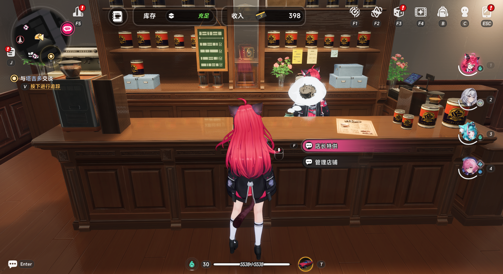

# NTE Auto Owner's Selection

用于自动刷《异环》店长特供 `1-1` 关卡的 AutoHotkey 脚本。

当前脚本行为很简单：

- 以热键 `P` 启动
- 自动执行店长特供 `1-1` 共 `34` 次
- 依赖固定鼠标坐标点击，因此需要保持分辨率、界面缩放和站位一致

## 文件

- `自动店长特供1-1.ahk`：脚本本体
- `启动位置.png`：按下 `P` 前的角色站位参考图
- `辅助雇员.png`：辅助雇员选择参考图
- `海月等级.png`：海月都市特技等级参考图

## 使用前准备

1. 先手动完整打通一次店长特供 `1-1`，让游戏中的默认关卡固定为 `1-1`。
2. 辅助雇员必须选择 `海月`，与下图保持一致。
3. 海月的都市特技等级必须达到 `3` 级，与下图保持一致。
4. 将游戏窗口、分辨率、UI 缩放和角色站位调整到与 [启动位置.png](./启动位置.png) 一致。
5. 使用管理员权限运行 `自动店长特供1-1.ahk`，或运行编译后的 `exe`。

## 使用方法

1. 进入店长特供界面，并把角色移动到下图位置。
2. 在该位置面向柜台，确保交互项已经出现。
3. 按下键盘 `P` 开始自动执行。
4. 脚本会自动刷 `34` 次，期间不要移动鼠标或切换窗口。

## 编译环境

本脚本使用 AutoHotkey v1 语法。

- 源码仓库：<https://github.com/AutoHotkey/AutoHotkey-v1.0>
- 如需自行编译，可使用该仓库对应的 AutoHotkey v1.0 环境 / 工具链进行处理

## 注意事项

- 脚本使用固定坐标点击，默认只适合同一套分辨率与窗口布局。
- 使用脚本时必须使用 `海月` 作为辅助雇员，且海月都市特技等级必须为 `3` 级。
- 如果你没有先手动打一遍 `1-1`，默认关卡可能不是 `1-1`，脚本会点错流程。
- 管理员权限运行是为了避免脚本输入和点击被系统权限拦截。
- 自动化脚本可能违反游戏规则，封禁或其他后果请自行承担。

## 许可证

本仓库使用 [MIT License](./LICENSE)。
