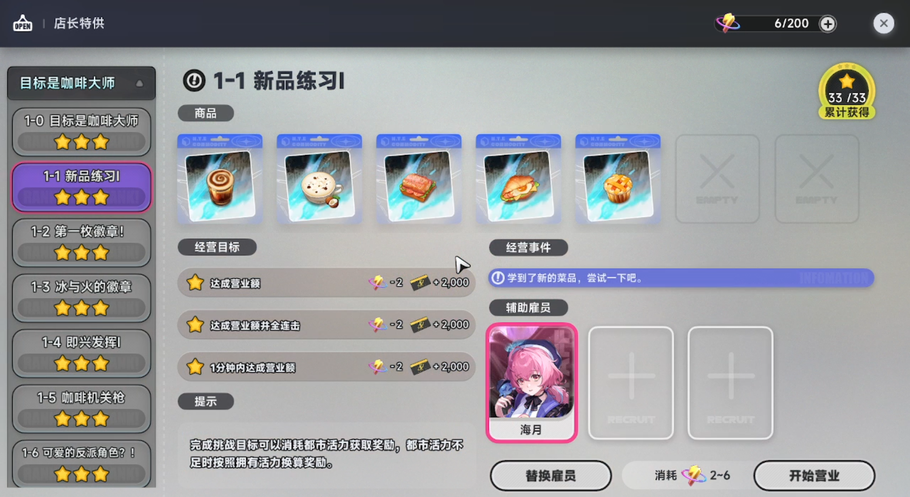
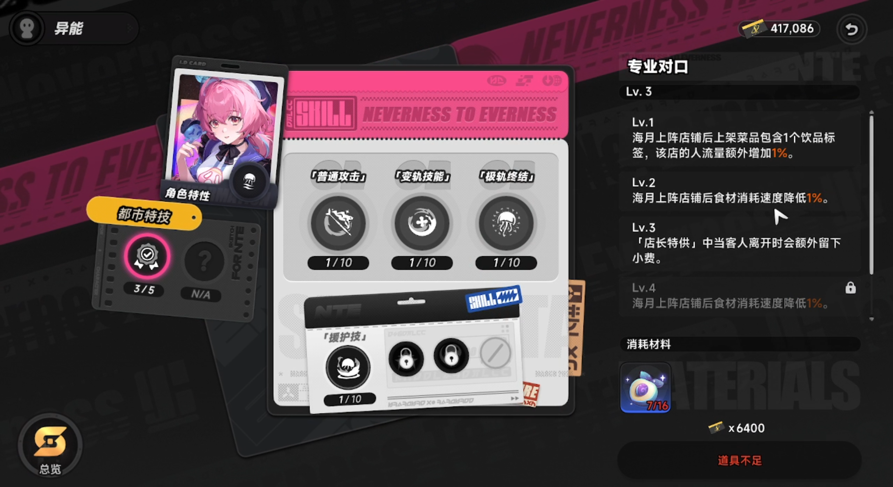

# NTE Auto Owner's Selection

An AutoHotkey script that auto-farms the *Owner's Selection* `1-1` stage in **Neverness To Everness (NTE / 异环)**.

What the script does:

- On launch, shows a resolution picker supporting `1080p (1920x1080)`, `2K (2560x1440)`, and `4K (3840x2160)`. Default is `4K`.
- Press the `P` hotkey to start the automation.
- Runs *Owner's Selection* `1-1` for `34` iterations.
- Drives the UI by clicking fixed coordinates (calibrated against `1920x1080` and auto-scaled to the selected resolution), so the in-game UI scale and character position must stay consistent.

## Files

- `auto-owners-selection-1-1.ahk` — the script itself
- `starting-position.png` — reference image for the character's position before pressing `P`
- `support-employee.png` — reference for the required support employee selection
- `haiyue-skill-level.png` — reference for Haiyue's Urban Skill level

## Prerequisites

1. Manually clear *Owner's Selection* `1-1` once so that the game's default selected stage is fixed to `1-1`.
2. Set your support employee to **Haiyue** (海月), matching the image below.
3. Haiyue's Urban Skill must be at **level 3**, matching the image below.
4. Run the game in **fullscreen** at one of the supported resolutions (`1920x1080`, `2560x1440`, or `3840x2160`). Place your character to match [starting-position.png](./starting-position.png), and make sure *Owner's Selection* is the focused option.
5. Run `auto-owners-selection-1-1.ahk` as **Administrator** (or run the compiled `.exe` as Administrator). Make sure your IME is set to **English** while the script is running.
6. When the script starts, a **resolution picker** appears — click the button that matches your in-game resolution (defaults to `4K`).

## How to use

1. Enter the *Owner's Selection* screen and move your character to the position shown below.
2. Face the counter and confirm the interaction prompt has appeared.
3. Press `P` to start the automation.
4. The script will run `34` iterations. Do not move the mouse or switch windows during this time.

## Build environment

The script is written in **AutoHotkey v1** syntax.

- Source repo: <https://github.com/AutoHotkey/AutoHotkey-v1.0>
- To compile your own `.exe`, use the AutoHotkey v1.0 toolchain from that repo.

## Notes

- Coordinates are based on `1920x1080` and scaled to the selected resolution. Only `1080p / 2K / 4K` are supported; other resolutions or non-integer UI scaling may cause misclicks.
- Always pick the resolution that matches the game — the wrong selection will cause the script to click in the wrong places.
- You must use **Haiyue** as your support employee, with her Urban Skill at level 3.
- If you have not manually cleared `1-1` first, the default stage may not be `1-1` and the script will follow the wrong flow.
- Administrator privileges are required so the script's inputs and clicks are not blocked by Windows.
- Automation scripts may violate the game's terms of service. Any bans or other consequences are your responsibility.

## License

This repository is released under the [MIT License](./LICENSE).
